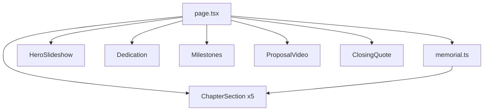

# ARCHITECTURE.md — Meu Amorzinho

## Visão geral

Single-page memorial estático. Next.js 15 App Router, sem backend, sem Supabase.

## Stack

| Camada | Tecnologia |
|--------|------------|
| Framework | Next.js 15 (App Router) |
| UI | Tailwind CSS 3 + componentes custom |
| Motion | GSAP + ScrollTrigger (`@gsap/react`) |
| Fonts | next/font/google — Cormorant Garamond, Inter |
| Imagens | next/image |
| Vídeo | HTML5 `<video>` nativo |
| Deploy | Vercel (recomendado) |

## Estrutura de pastas

```
projects/meu-amorzinho/
├── assets/                 # originais (fonte)
├── public/media/           # URLs limpas servidas
├── content/
│   └── memorial.ts         # capítulos, legendas, meta
├── app/
│   ├── layout.tsx
│   ├── page.tsx
│   └── globals.css
├── components/memorial/
│   ├── MemorialNav.tsx
│   ├── HeroVideo.tsx
│   ├── scripts/generate-hero-clip.ps1
│   ├── Dedication.tsx
│   ├── ChapterSection.tsx
│   ├── PhotoCard.tsx
│   ├── ProposalVideo.tsx
│   ├── Milestones.tsx
│   ├── ClosingQuote.tsx
│   └── MemorialFooter.tsx
├── lib/
│   ├── memorial-animations.ts
│   └── useMemorialScrollAnimations.ts
└── [artefatos pipeline]
```

## Modelo de dados

```typescript
type MemorialItem = {
  src: string;
  alt: string;
  caption: string;
};

type MemorialChapter = {
  id: string;
  number: string;
  title: string;
  subtitle?: string;
  items: MemorialItem[];
  video?: { src: string; caption: string; poster?: string };
};

type MemorialContent = {
  meta: { title: string; description: string };
  hero: { title: string; subtitle: string; tagline: string; slides: string[] };
  dedication: string;
  chapters: MemorialChapter[];
  milestones: { number: string; title: string; description: string }[];
  closing: { quote: string; signature: string; footer: string };
};
```

## Fluxo de renderização



## Decisões

| Decisão | Motivo |
|---------|--------|
| Sem shadcn | Personalidade editorial única (DESIGN.md) |
| content/memorial.ts | Single source of truth com COPY.md |
| public/media/ renomeado | URLs sem espaços/acentos |
| assets/ preservado | Originais intactos |
| Fase 7b skip | Sem auth, DB ou API |

## SUPABASE-SCHEMA.md

**Não aplicável** — projeto estático sem persistência.

## Performance

- `next/image` com `sizes` responsivos
- Lazy loading abaixo da dobra
- Vídeo: `preload="metadata"`, poster image
- GSAP registrado client-side only

## Segurança

- Sem secrets no repo
- Site público ou link privado via deploy URL

## Build

```bash
cd projects/meu-amorzinho
npm install
npm run build
npm run dev
```

## SOLID (aplicação leve)

- **SRP:** cada componente = uma seção
- **OCP:** novos capítulos via `memorial.ts` sem alterar layout
- **DIP:** page depende de `MemorialContent`, não de paths hardcoded
